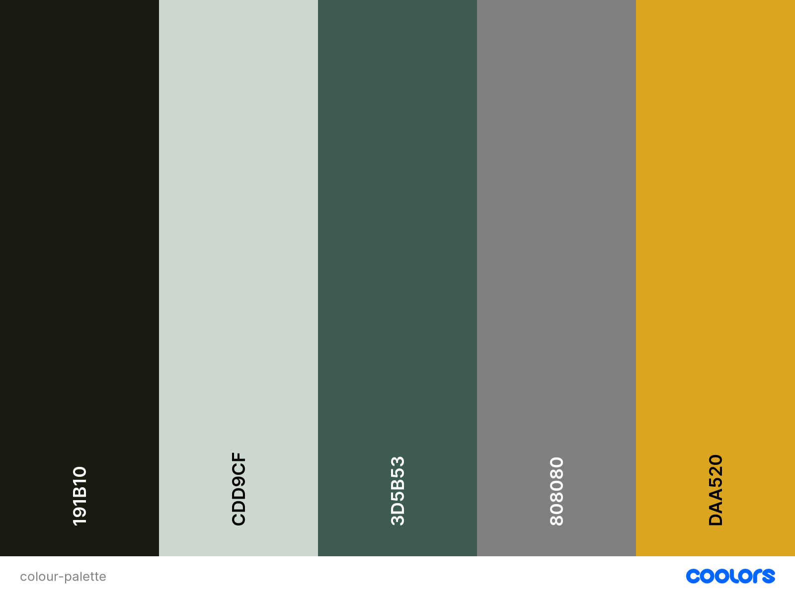
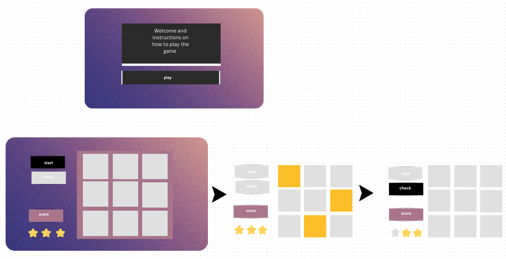
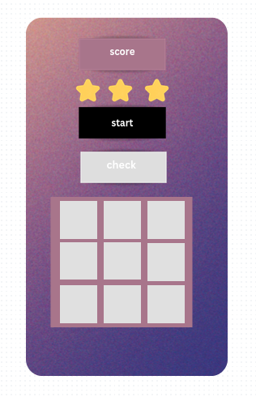

# Code Institute - Milestone Project 2

## Memory game

The goal of the Memory Game is to remember the highlighted tiles. The tiles reveal themselves momentarily before flipping back over. Once certain level is acheved additional Cheeky monkey tile is revieled. This tile contains a picture of monkey with background identical to the highlighted tiles. Monkey tile is just a distraction and it is not a part of the pattern. When answering, once the tile is clicked the answer cannot be changed. Game ends with a win if all the levels are cleared giving us final score of 11. Game ends with a loss if player makes three mistakes. After either of the outcomes the game can be played again.

---
## Project goals
 
 
---
 
## User Stories
 
---

## Design
 
 
### Colour Scheme
 
Colour palette is based in greens, grey and goldenrod. The background is ment to be not distracting for the player while goldenrod colour is ment to stand out and help player remember positioning of the tiles.

 
### Images

Background image was downladed from https://pixabay.com/
Picture of the monkey was downloaded from https://www.irasutoya.com/
Both pages allow for a noncommercial use of the images.
 
### Icons

Icons used to show remaining lives are imported from Font Awesome using a link placed in the head of html page.

---
 
## Wireframes

Wireframes were creatied using Canva online graphic design tool. 

### Desktop
 

 

### Mobile

 
 
---

## Features

### Features on index.html

The main page is very simple. It contains header with the name of the game, instructions and the play button which takes us to the game page.

### Features on gamepage.html

Game page is set up as flex box with two setions:

1) Score and Lives (in a form of stars) which update accordingly whe players answer is correct or incorrect. 
Play and Check answer button. Depending on the stage of the game buttons can be disabled or their inner html changes. 

2) Game area set up in grid.

On wider screens two sections are placed side by side.

---
 
## Languages used

---

## Resources used

---

## Testing

### HTML Validatior

### CSS Validator

### Java Script validator

### Manual tests
 
---

## Fixed bugs

---
 
## Unfixed bugs
 
---

## Responsiveness

---

## Deployment

---

## Cloning the Github repository

---

## Forking the Github repository

---

## Credits

---

## Acknowledgements

