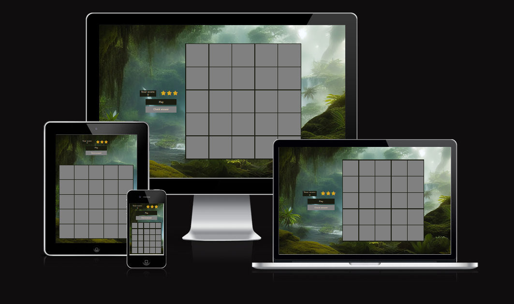

# Code Institute - Milestone Project 2

## Memory game

The goal of the Memory Game is to remember the highlighted tiles. The tiles reveal themselves momentarily before flipping back over. Once a certain level is achieved additional Cheeky monkey tile is revealed. This tile contains a picture of a monkey with a background identical to the highlighted tiles. Monkey tile is just a distraction and it is not a part of the pattern. When answering, once the tile is clicked the answer cannot be changed. Game ends with a win if all the levels are cleared giving us a final score of 11. Game ends with a loss if the player makes three mistakes. After either of the outcomes the game can be played again.

[Play game](https://annasedab.github.io/Project2-memory-game/)

---
## Project goals

- Provide users with an easy game they can play in spare time
- Provide users with a game to train their memory
- Provide users with a game to train their focus
- Provide users with a game they can play for just few minutes at a time without commitment

---
## User Stories

- I want to play a quick game
- I want to train my memory
- I want to improve my concentration
- I have some time to kill and I want to use it productively whilst doing something fun
- I am procrastinating but cannot commit to doing anything actually productive so I am pretending to do something productive by playing a game training my memory

---

## Design
### Colour Scheme
Colour palette is based on greens, grey and goldenrod. The background is meant to be not distracting for the player while goldenrod colour is meant to stand out and help players remember positioning of the tiles.

### Images

Background image was downloaded from https://pixabay.com/
Picture of the monkey was downloaded from https://www.irasutoya.com/
Both pages allow for a noncommercial use of the images.
### Icons

Icons used to show remaining lives are imported from Font Awesome using a link placed in the head of the html page.

---
## Wireframes

Wireframes were created using Canva online graphic design tool.

### Desktop

### Mobile

---

## Features

### Features on index.html

The main page is very simple. It contains a header with the name of the game, instructions and the play button which takes us to the game page.

### Features on gamepage.html

Game page is set up as flex box with two sections:

1) Score and Lives (in the form of stars) which update accordingly when a player's answer is correct or incorrect.
Play and Check answer button. Depending on the stage of the game buttons can be disabled or their inner html changes.

2) Game area is set up in a grid.

On wider screens two sections are placed side by side.

---
## Languages used

- HTML
- CSS
- MARKDOWN
- JavaScript

---

## Resources used

- Font awesome - importing star icons representing lives
- W3Schools - used to find solutions to problems with code
- Stack overflow - used to find solutions to problems with code
- Firefox developer tools - checking responsiveness and observing effect of code changes in real time
- Slack - used to find the solutions for the encountered problems with code
- Canva - used for creating wireframes
- Github - used as a repository and to host the deployed website
- Gitpod - used to build and develop the website
- Code Institute - used to review concepts covered in the course
- W3C CSS Validation Service - used to validate the CSS file
- W3C HTML Validation Service - used to validate the HTML files
- JSHint - used to validate the JavaScript files
- https://codebeautify.org/jsviewer - used to beautify java script
- https://beautifier.io/ - used to beautify CSS and HTML code
- Coolors - used to create colour palette
- Am I responsive - used to create mock up image of ho the website will look on different screen sizes
- Gimp - used for resizing and adding background to the monkey picture
- Pixabay used to download background image
- Irasutoya used to download picture of the monkey

---

## Testing

Code went through validators without bigger problems.
Java Script validator showed some missed semicolons and minor problem that might occur with variable within function which was easily fixed.

### HTML Validator

Main page

Game page

### CSS Validator

### Java Script validator - JSHint

### Manual tests
Throughout the creation the game was tested to check if it is working as intended.
Variables were checked via console logs to see if the functions work correctly.
Play and Check buttons were clicked at various stages of the game to check if they behave as expected (disabled and enabled when they should be).
Tiles were clicked at all the stages of the game to check if they are responsive only when the player is meant to answer and they are not responsive at any other stage of the game.
Correct answer was provided to check if the score and number of tiles increased as expected.
Wrong answer was provided to check if score and lives are deducted while the number of tiles stays the same.
Mixtures of correct and wrong answers were given throughout the game to see if each time response is as it should be.
Monkey tile was selected to see if it causes the answer to be wrong even if all the other tiles picked were correct.
Game was lost to see if the appropriate message shows and the game can be reset.
Game was won to see if appropriate message shows and the game can be reset.

---

## Fixed bugs

After the first round tiles remained responsive and could be clicked at any point as function resetting the grid was placed in the wrong place. Function was then moved and called straight after checking the answer.

Code checking if the last level was played and game won was placed in a wrong place which meant that game could be won even if on the last level the answer was wrong. If the statement checking if ast level was reached was moved.

Function picking tiles to lit was not picking the right number of tiles. The code was constructed from scratch with the help of explanation and example given by my mentor Mitko Bachvarov.

---

## Responsiveness

Flex boxes and grid are used in order to make the site responsive.
Upon completing website was tested on following browsers and devices:

Upon completing website was tested on following browsers and devices:
- Desktop browsers:
  - Firefox
  - Chromium
  - Chrome
- Mobile devices:
  - Galaxy S7
  - Huawei ELE-L29

also in Firefox developer tools on different screen sizes.
---

## Deployment

- Logg to the Github website
- Select **Project2-memory-game** repository
- Select **Settings** from the navigation bar
- Select **Pages** from the menu on the left
- Pick source **Deploy from branch**
- Pick branch **main**
- Click save button
- Link to the website appears at the top of the page

---

## Cloning the Github repository

- Log in to the Github
- Select **Project2-memory-game** repository
- Click on the **Code** button located next to the green Gitpod button
- Copy link from the HTTPS section
- Open terminal
- Change the current working directory to the location where you want the cloned directory
- Type "git clone" and the previously copier URL
- Press **Enter**

---

## Forking the Github repository

- Log in to the Github
- Select **Project2-memory-game** repository
- Click on the **Fork** button located on the right top section of the page
- The copy of original repository is made into your Github account

---

## Credits

Code was written by me with the help of explanations found on W3Schools and Stack overflow.

Function picking tiles to lit was constructed thanks to explanation and example given by my mentor Mitko Bachvarov.

[Function used to compare arrays](https://stackoverflow.com/questions/3115982/how-to-check-if-two-arrays-are-equal-with-javascript) was found on Stack overflow. 

---

## Acknowledgements

Huge thank you to my mentor Mitko Bachvarov for guiding me through the project and helping me understand the code I need to write in order for the game to work.

