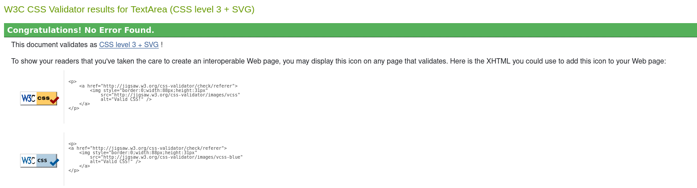

# Code Institute - Milestone Project 2

## Memory game

The goal of the Memory Game is to remember the highlighted tiles. The tiles reveal themselves momentarily before flipping back over. Once certain level is acheved additional Cheeky monkey tile is revieled. This tile contains a picture of monkey with background identical to the highlighted tiles. Monkey tile is just a distraction and it is not a part of the pattern. When answering, once the tile is clicked the answer cannot be changed. Game ends with a win if all the levels are cleared giving us final score of 11. Game ends with a loss if player makes three mistakes. After either of the outcomes the game can be played again.

---
## Project goals
 
 
---
 
## User Stories
 
---

## Design
 
 
### Colour Scheme
 
Colour palette is based in greens, grey and goldenrod. The background is ment to be not distracting for the player while goldenrod colour is ment to stand out and help player remember positioning of the tiles.

 
### Images

Background image was downladed from https://pixabay.com/
Picture of the monkey was downloaded from https://www.irasutoya.com/
Both pages allow for a noncommercial use of the images.
 
### Icons

Icons used to show remaining lives are imported from Font Awesome using a link placed in the head of html page.

---
 
## Wireframes

Wireframes were creatied using Canva online graphic design tool. 

### Desktop
 

 

### Mobile

 
 
---

## Features

### Features on index.html

The main page is very simple. It contains header with the name of the game, instructions and the play button which takes us to the game page.

### Features on gamepage.html

Game page is set up as flex box with two setions:

1) Score and Lives (in a form of stars) which update accordingly whe players answer is correct or incorrect. 
Play and Check answer button. Depending on the stage of the game buttons can be disabled or their inner html changes. 

2) Game area set up in grid.

On wider screens two sections are placed side by side.

---
 
## Languages used

- HTML
- CSS
- MARKDOWN
- JavaScript

---

## Resources used

- Font awesome - importing star icons representing lives
- W3Schools - used to find solutions to problems with code
- Stack overflow - used to find solutions to problems with code
- Firefox developer tools - checking responsiveness and observing effect of code changes in real time
- Slack - used to find the solutions for the encountered problems with code
- Canva - used for creating wireframes
- Github - used as a repository and to host the deployed website
- Gitpod - used to build and develop the website
- Code Institute - used to review concepts covered in the coursep
- W3C CSS Validation Service - used to validate the CSS file
- W3C HTML Validation Service - used to validate the HTML files
- JSHint - used to validate the JavaScript files
- https://codebeautify.org/jsviewer - used to beautife java script
- https://beautifier.io/ - used to beautify CSS and HTML code
- Coolors - used to create colour palette
- Am I responsive - used to create mock up image of ho the website will look on different screen sizes
- Gimp - used for resizing and adding background to the monkey picture
- Pixabay used to download background image
- Irasutoya used to dwonload picture of the monkey

---

## Testing

Code went through validators without bigger problems. 
Java Script validator showed some missed semicolons and minor problem that might occur with varable within function which was easly fixed.

### HTML Validatior

Main page

Game page

### CSS Validator

### Java Script validator - JSHint

### Manual tests
 
Throughout the creation gamee was tested to check if it is working as intended.
Variables were checked via colsole logs to see if the functions work correctly.
Play and Check buttons were clicked at various stages of the game to check if the behave as expected (disabled and enabled when they should be). 
Tiles were clicked at all the stages of game to check if the are responsive only when player is ment to answer and the are not responsive at any other stage of the game. 
Correct answer was provided to check if score and number of tiles increases as expected.
Wrong answer was provided to check if score and lives are deducted while number of tiles stays the same.
Mixture of correct and wrong answers were given throughout the game to see if eache time response is as it should be.
Monkey tile was selected to see if it causes answer to be wrong even if all the other tiles picked were correct.
Game was lost to see if appropriate message shows and game can be reset.
Game was won to see if appropriate message shows and game can be reset.

---

## Fixed bugs

After first round tiles remained responsive and could be clicked at any point as function resetting the grid was placed in the wrong place. Function was then moved and called straight after checking the answer.

Code checking if the last level was played and game won was placed in a wrong place which ment that game could be won even if on the last level the answer was wrong. If statement checking if ast level was reached was moved.

Function picking tiles to lit was not picking right number of tiles. The code was constructed from scratch with the help of explenation and example given by my mentor Mitko Bachvarov.

---

## Responsiveness

---

## Deployment

---

## Cloning the Github repository

---

## Forking the Github repository

---

## Credits

---

## Acknowledgements

